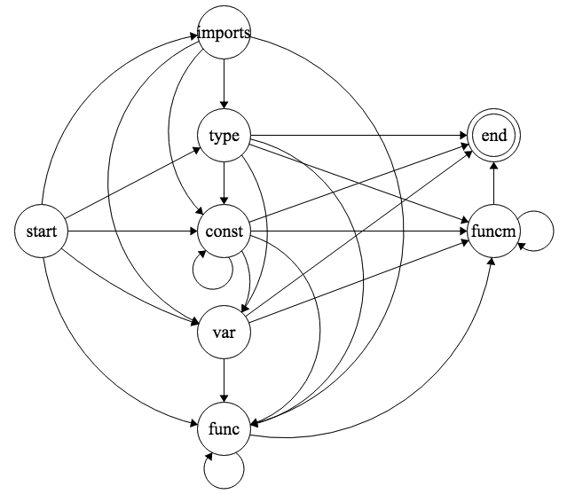

# nit

[](https://goreportcard.com/report/github.com/MarioCarrion/nit)
[](https://circleci.com/gh/MarioCarrion/nit)
[](http://gocover.io/github.com/MarioCarrion/nit)

`nit` is an opinionated Code Organization linter for Go.

It defines a collection of rules to determine how each Go file should be organized internally.

## Rules

1. [X] `imports` is the first section
   - [X] Requires parenthesized declaration,
   - [X] One maximum, and
   - [X] Separated in 3 blocks: standard, external and same package (local).
1. [X] `type` is the second section
   - [X] Requires parenthesized declaration,
   - [X] Section must be sorted: exported first, then unexported; and
   - [X] Supports `//-` comment for separating groups
1. [X] `const` is the third section
   - [X] Requires parenthesized declaration,
   - [X] Multiple allowed, and
   - [X] Section must be sorted: exported first, then unexported.
1. [X] `var` is the fourth section
   - [X] Requires parenthesized declaration, and
   - [X] Section must be sorted: exported first, then unexported.
1. [X] `func` is the fifth section
   - [X] Must be sorted, exported first, then unexported, and
   - [X] Supports `//-` comment for separating groups.
1. [X] `func` method, is the sixth section
   - [X] Must be sorted by type, exported first, then unexported; and
   - [X] Supports `//-` comment for separating groups.

Fancy State Machine explaining the rules above:



## Installing

* Using `go` (< 11.1): `go install github.com/MarioCarrion/nit/cmd/nit` **or** download a precompiled release.
* Using `go` (>= 1.11): `GO111MODULE=on go get github.com/MarioCarrion/nit/cmd/nit@v0.6.0`, for installing v0.6.0 for example; see the releases for other versions.
* Using it as a dependency with the [`tools.go` paradigm](https://github.com/go-modules-by-example/index/blob/master/010_tools/README.md):

```go
// +build tools

package tools

import (
	_ "github.com/MarioCarrion/nit/cmd/nit"
)
```

## Using

After installing you can use:

```
nit -pkg <base local package> $(go list ./...)
```

Please use `nit -h` for other available arguments.

## Development requirements

Go >= 1.13.1
